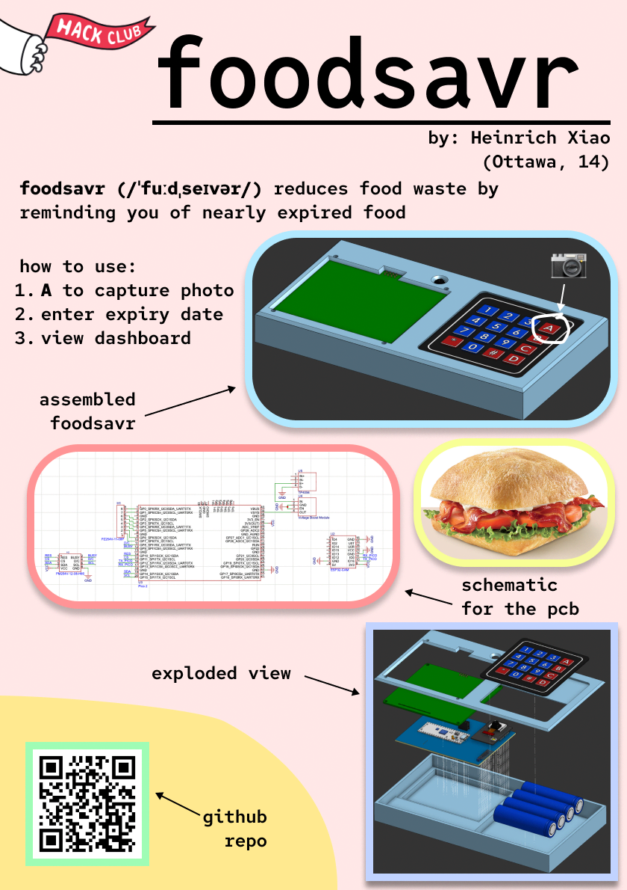

# foodsavr
~30% of food in the world is wasted and sent to landfills. foodsavr is a gadget that magnetically attaches to your fridge to remind you what food is close to expiring.

## Usage
To add a food item:
Show your food item to the camera and press the A button. Then, enter the expiry date of the item with the number pad. Then, confirm by pressing the A button again. Press D to cancel.

Press B and C to cycle up and down through the list of food items.

## Technical Details
foodsavr uses two microcontrollers. The ESP-32 CAM is used for the camera, but since it doesn't have enough pins, another board is necessary. The other dev board is an off-brand pico-like RP2040 board. For the display, it uses an E-Ink display from WeAct Studio. The matrix keypad is your standard membrane keypad that is in every single electronics kit. It uses a set of lipos for power with USB-C charging. The charger board is TP4056-based.

## Motivation
I designed this because I got tired of leaving food at the back of my fridge to rot. Especially, since I'd save my favourite foods for later, and yet forget about them until expiry. This project reminds you before they expire so that you never leave food in the back of your fridge for too long.

## BOM
Go to BOM.csv for the Bill of Materials

## Exploded 3D Model

## Assembled 3D Model

[Onshape URL](https://cad.onshape.com/documents/8ee8f266d123a24e5a0ce496/w/151140d60200875ea61c9eed/e/18a74606bdcc9369348646ee?renderMode=0&uiState=6a249579d641e38a22ea1bbf)

## PCB

## Schematic

## Zine Page

