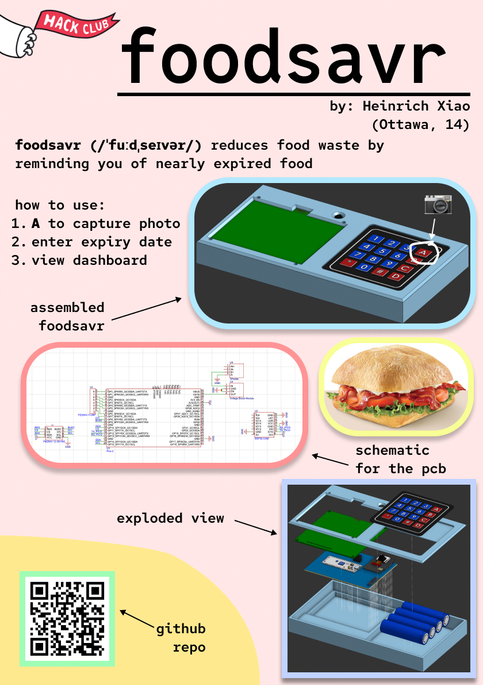

# foodsavr
~30% of food in the world is wasted and sent to landfills. foodsavr is a gadget that magnetically attaches to your fridge to remind you what food is close to expiring.

## Usage
To add a food item:
Show your food item to the camera and press the A button. Then, enter the expiry date of the item with the number pad. Finally, confirm by pressing the A button again. Press D to cancel.

Press B and C to cycle up and down through the list of food items.

## Technical Details
foodsavr uses two microcontrollers. The ESP-32 CAM is used for the camera, but since it doesn't have enough pins, another board is necessary. The other dev board is an off-brand pico-like RP2040 board. For the display, it uses an E-Ink display from WeAct Studio. The matrix keypad is your standard membrane keypad that is in every single electronics kit. It uses a set of lipos for power with USB-C charging. The charger board is TP4056-based.

## Build Guide
1. Insert the battery's JST connector into the charging board.
2. Insert the keypad's cable into its 1x8 header, with the keypad being in the slot on the top case.
3. Put the E-Ink display on the 2x4 header on the PCB.
4. Plop the top case on the display so that the screw holes of the display line up.
5. Use the M3 nuts and bolts to secure the display.
6. For the two corners on the right, insert the M3 heatset inserts into the holes.
7. Add a thin layer of cyanoacryalte glue around the bottom of the magnet holes. Then, insert the magnets.
8. Send a right angled USB-C cable through the hole in the bottom case and plug it into the off brand USB-C Pico. Send a normal USB-C cable through the same hole and plug it into the battery charging board (The hole is large enough to accommodate two cables.)
9. Finally, fasten the bottom case so that the PCB rests in the tray with the M3.

## Motivation
I designed this because I got tired of leaving food at the back of my fridge to rot. Especially, since I'd save my favourite foods for later, and yet forget about them until expiry. This project reminds you before they expire so that you never leave food in the back of your fridge for too long.

## BOM
|Name                                                |Links                                                |Price (CAD)|
|----------------------------------------------------|-----------------------------------------------------|-----------|
|PCB                                                 |https://jlcpcb.com/                                  |$6.66      |
|E-Paper Screen                                      |https://www.aliexpress.com/item/1005007133350270.html|$30.45     |
|Ferrite Magnets (10x3mm)                            |https://www.aliexpress.com/item/1005008858265927.html|$11.24     |
|Fake Pico                                           |https://www.aliexpress.com/item/1005005617180169.html|$3.07      |
|Number Pad                                          |https://www.aliexpress.com/item/1005009455766218.html|$2.14      |
|4x 18650 12000mAh                                   |https://www.aliexpress.com/item/1005009903616172.html|$39.40     |
|TP4056 JST USB-C Module                             |https://www.aliexpress.com/item/1005006943878636.html|$2.62      |
|Voltage Booster                                     |https://www.aliexpress.com/item/1005007385896399.html|$3.48      |
|Right-Angle Headers                                 |https://www.aliexpress.com/item/1005006795400618.html|$4.07      |
|ESP32 CAM w/ Flasher                                |https://www.aliexpress.com/item/1005006137530316.html|$13.52     |
|M3x10mm with nut                                    |https://www.aliexpress.com/item/32799844538.html     |$3.31      |
|Heatset Inserts (M3 5mm OD w/ 10mm length)          |https://www.aliexpress.com/item/1005003582355741.html|$3.93      |
|Right angled USBC cable|https://ja.aliexpress.com/item/1005009168667192.html|$6.48|
|Subtotal                                            |N/A                                                  |$130.37    |
|Total (After Aliexpress Discounts subject to change)|N/A                                                  |CAD$97.06  |
|USD Total                                           |N/A                                                  |USD$68.54  |

## Assembled 3D Model

https://cad.onshape.com/documents/8ee8f266d123a24e5a0ce496/w/151140d60200875ea61c9eed/e/18a74606bdcc9369348646ee?renderMode=0&uiState=6a249579d641e38a22ea1bbf

## PCB

## Schematic

## Zine Page

